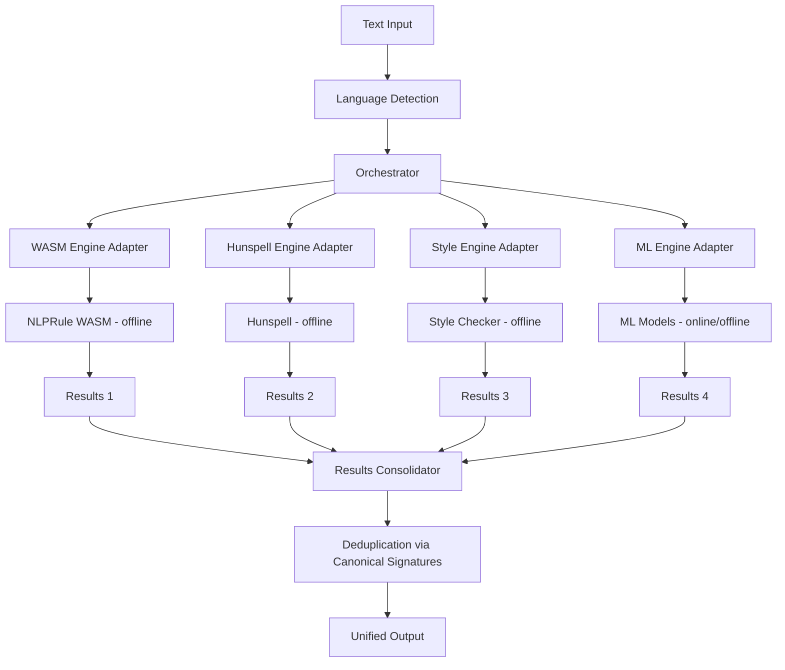
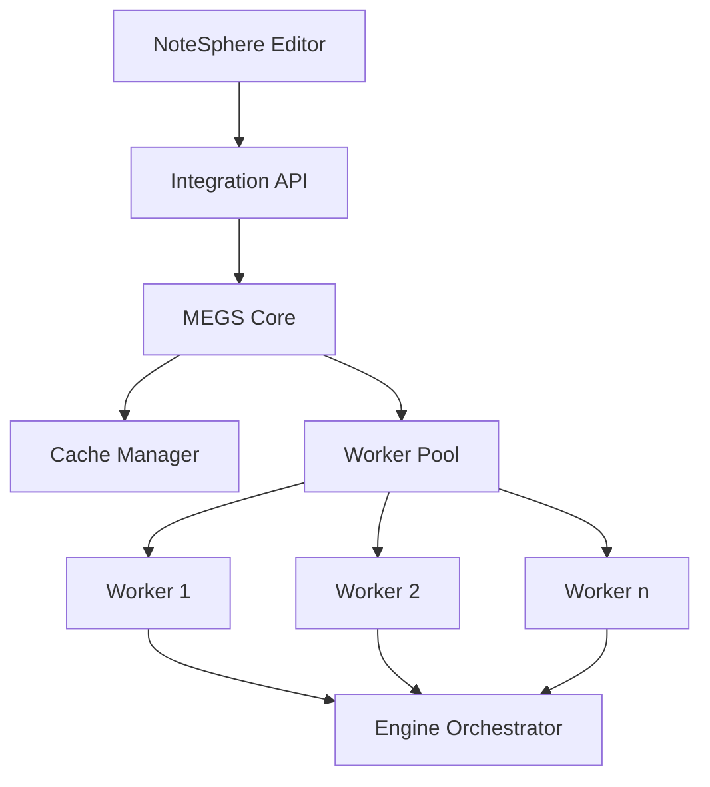
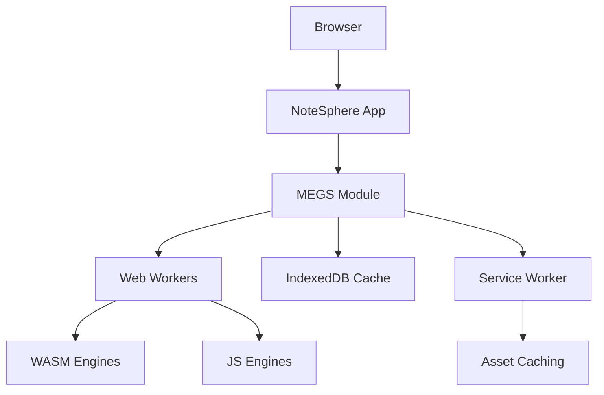

# Design Document: Multi-Engine Grammar System

## Overview

The Multi-Engine Grammar System (MEGS) is designed to be a high-performance, extensible grammar checking platform that combines multiple specialized engines to provide comprehensive writing assistance. The system orchestrates various NLP engines (nlprule WASM, Hunspell, style checkers, and optional ML models) to work in parallel, consolidating their outputs into unified, actionable feedback for users.

This design document outlines the architecture, components, interfaces, data models, error handling, and testing strategy for implementing MEGS as a flagship feature of NoteSphere.

## Architecture

MEGS follows a modular, pipeline-based architecture with the following key layers:

### 1. Core Orchestration Layer



### 2. Engine Layer

The system will integrate multiple specialized engines:

- **NLPRule WASM Engine**: Core grammar checking using WebAssembly for performance
- **Hunspell Engine**: Spelling correction and custom dictionary support
- **Style Checker Engine**: Style suggestions using write-good, Vale, or similar libraries
- **ML Engine** (optional): Advanced contextual suggestions using lightweight ML models

### 3. Integration Layer



### 4. Deployment Architecture



## Components and Interfaces

### 1. Orchestrator

The central component that manages the workflow of text processing through multiple engines.

```typescript
interface Orchestrator {
  initialize(config: OrchestratorConfig): Promise<void>;
  process(text: string, options?: ProcessOptions): Promise<GrammarResult>;
  registerEngine(engine: GrammarEngine): void;
  unregisterEngine(engineId: string): void;
  getStatus(): EngineStatus[];
}

interface OrchestratorConfig {
  concurrency: number;
  timeout: number;
  engineTimeouts: { [engineId: string]: number }; // Per-engine defaults (nlprule:200ms, hunspell:100ms, vale:300ms)
  engineRetries: { [engineId: string]: number }; // Per-engine retry counts
  cacheEnabled: boolean;
  cacheSize: number;
  priorityEngines?: string[];
  fallbackStrategy: 'continue' | 'degrade' | 'fail';
  initSequence: string[]; // Defines the initialization order (WASM → Hunspell → Style → ML)
}

interface ProcessOptions {
  engines?: string[];
  priority?: 'speed' | 'accuracy' | 'balanced';
  timeout?: number;
  language?: string;
  domain?: string;
}
```

### 2. Engine Adapter

A standardized interface for all grammar engines to implement.

```typescript
interface GrammarEngine {
  id: string;
  name: string;
  version: string;
  capabilities: EngineCapability[];
  mode: 'offline' | 'online'; // Engine mode tag for graceful offline behavior
  initialize(): Promise<void>;
  process(text: string, options?: EngineOptions): Promise<EngineResult>;
  shutdown(): Promise<void>;
  getStatus(): EngineStatus;
}

interface EngineOptions {
  language?: string;
  domain?: string;
  timeout?: number;
  rules?: RuleConfig[];
}

enum EngineCapability {
  GRAMMAR,
  SPELLING,
  STYLE,
  PUNCTUATION,
  ADVANCED_CONTEXT,
  MULTILINGUAL
}
```

### 3. Results Consolidator

Responsible for deduplicating, merging, and prioritizing results from multiple engines.

```typescript
interface ResultsConsolidator {
  consolidate(results: EngineResult[]): GrammarResult;
  setDeduplicationStrategy(strategy: DeduplicationStrategy): void;
  setPriorityRules(rules: PriorityRule[]): void;
}

type DeduplicationStrategy = 'strict' | 'overlap' | 'semantic';

interface PriorityRule {
  engineId: string;
  category: string;
  priority: number;
}
```

### 4. Cache Manager

Optimizes performance by caching results for frequently checked text.

```typescript
interface CacheManager {
  get(key: string): Promise<GrammarResult | null>;
  set(key: string, result: GrammarResult): Promise<void>;
  invalidate(key: string): Promise<void>;
  clear(): Promise<void>;
  getStats(): CacheStats;
}

interface CacheStats {
  hits: number;
  misses: number;
  size: number;
  efficiency: number;
}
```

### 5. Worker Pool

Manages a pool of Web Workers for parallel processing.

```typescript
interface WorkerPool {
  initialize(count: number): Promise<void>;
  execute<T>(task: WorkerTask, data: any): Promise<T>;
  terminate(): void;
  getStatus(): WorkerStatus[];
}

interface WorkerTask {
  type: string;
  priority: number;
  timeout?: number;
}

interface WorkerStatus {
  id: number;
  busy: boolean;
  taskCount: number;
  lastTaskDuration: number;
}
```

### 6. Integration API

Provides a simple interface for NoteSphere to interact with MEGS.

```typescript
interface MegsApi {
  check(text: string, options?: CheckOptions): Promise<GrammarResult>;
  applyCorrection(correction: Correction): string;
  getEngines(): EngineInfo[];
  configure(config: MegsConfig): void; // Must apply new rules/dicts at runtime (hot-reload support)
  getStatus(): MegsStatus;
}

interface CheckOptions {
  language?: string;
  domain?: string;
  priority?: 'speed' | 'accuracy' | 'balanced';
  categories?: string[];
  customRules?: RuleConfig[];
}
```

## Data Models

### 1. Grammar Result

```typescript
interface GrammarResult {
  issues: GrammarIssue[];
  metadata: ResultMetadata;
  text: string;
  language: string;
}

interface GrammarIssue {
  id: string;
  type: IssueType;
  severity: IssueSeverity;
  category: string;
  message: string;
  explanation?: string;
  suggestions: Suggestion[];
  range: TextRange;
  source: string; // Engine ID
  confidence: number;
  ignored: boolean;
}

enum IssueType {
  GRAMMAR,
  SPELLING,
  STYLE,
  PUNCTUATION,
  CONTEXT
}

enum IssueSeverity {
  ERROR,
  WARNING,
  SUGGESTION,
  INFO
}

interface Suggestion {
  text: string;
  confidence: number;
  explanation?: string;
}

interface TextRange {
  start: number;
  end: number;
  startLine: number;
  startCol: number;
  endLine: number;
  endCol: number;
}

interface ResultMetadata {
  processingTime: number;
  enginesUsed: string[];
  timestamp: number;
  cacheHit: boolean;
  version: string;
}
```

### 2. Engine Result

```typescript
interface EngineResult {
  engineId: string;
  issues: EngineIssue[];
  metadata: EngineMetadata;
}

interface EngineIssue {
  id: string;
  type: string;
  category: string;
  message: string;
  explanation?: string;
  suggestions: EngineSuggestion[];
  range: EngineTextRange;
  confidence?: number;
  ruleId?: string;
}

interface EngineSuggestion {
  text: string;
  confidence?: number;
}

interface EngineTextRange {
  start: number;
  end: number;
  context?: string;
}

interface EngineMetadata {
  processingTime: number;
  version: string;
  ruleCount?: number;
  language: string;
}
```

### 3. Configuration Models

```typescript
interface MegsConfig {
  engines: EngineConfig[];
  global: GlobalConfig;
  rules: RuleConfig[];
  cache: CacheConfig;
}

interface EngineConfig {
  id: string;
  enabled: boolean;
  priority: number;
  options?: Record<string, any>;
}

interface GlobalConfig {
  concurrency: number;
  timeout: number;
  defaultLanguage: string;
  fallbackStrategy: string;
}

interface RuleConfig {
  id: string;
  enabled: boolean;
  category: string;
  severity?: IssueSeverity;
}

interface CacheConfig {
  enabled: boolean;
  maxSize: number;
  ttl: number;
}
```

## Error Handling

### 1. Error Types

```typescript
enum ErrorType {
  INITIALIZATION_ERROR,
  ENGINE_ERROR,
  TIMEOUT_ERROR,
  WORKER_ERROR,
  RESOURCE_ERROR,
  CONFIGURATION_ERROR,
  UNKNOWN_ERROR
}

interface MegsError {
  type: ErrorType;
  message: string;
  engineId?: string;
  recoverable: boolean;
  details?: any;
}
```

### 2. Error Handling Strategy

- **Graceful Degradation**: If an engine fails, continue with remaining engines
- **Timeout Management**: Set timeouts for each engine to prevent blocking
- **Retry Logic**: Implement exponential backoff for transient errors
- **Fallback Mechanisms**: Define fallback strategies for critical failures
- **Error Reporting**: Log detailed error information for debugging
- **User Feedback**: Provide appropriate error messages to users

### 3. Recovery Mechanisms

- **Engine Reinitialization**: Automatically reinitialize failed engines
- **Resource Management**: Unload and reload resources as needed
- **Configuration Validation**: Validate configurations before applying
- **State Recovery**: Maintain state to recover from interruptions
- **Circuit Breaker**: Temporarily disable problematic engines

## Testing Strategy

### 1. Unit Testing

- Test each component in isolation with mocked dependencies
- Verify correct behavior for normal and edge cases
- Test error handling and recovery mechanisms
- Ensure proper resource management

### 2. Integration Testing

- Test interactions between components
- Verify correct data flow through the system
- Test configuration changes and their effects
- Validate engine adapter implementations

### 3. Performance Testing

- Benchmark processing time for various text sizes
- Measure memory usage under different loads
- Test concurrency and parallelism
- Evaluate caching effectiveness

### 4. Accuracy Testing

- Compare results against benchmark datasets
- Measure precision and recall for different error types
- Test with various writing styles and domains
- Evaluate deduplication and consolidation accuracy

### 5. Cross-Platform Testing

- Test on different browsers and devices
- Verify offline functionality
- Test with different resource constraints
- Validate responsive behavior

### 6. Continuous Integration

- Automate tests in CI/CD pipeline
- Compare performance metrics against baselines
- Enforce code quality standards
- Generate test coverage reports