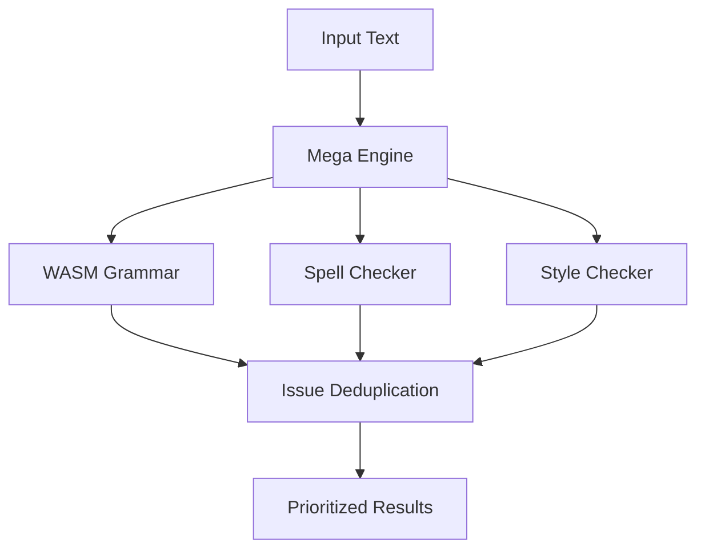

# @notesphere/mega-engine

🚀 **The Ultimate 100% Free, Offline Grammar Checker**

A production-ready TypeScript package that combines the power of nlprule WASM, Hunspell, SymSpell, write-good, and retext plugins into a single, blazing-fast grammar engine. Zero network calls, maximum accuracy.

## Features

- ✅ **100% Offline** - No network calls, all processing happens locally
- 🚀 **Lightning Fast** - WASM-powered with intelligent caching
- 🎯 **Comprehensive** - Grammar, spelling, style, and inclusivity checking
- 🔧 **Extensible** - Modular architecture, disable/enable engines as needed
- 🌐 **Universal** - Works in both Node.js and browsers
- 📦 **Zero Dependencies** - Self-contained with all assets included
- 🛠️ **TypeScript** - Full type safety and excellent DX

## Quick Start

```bash
npm install @notesphere/mega-engine
```

```typescript
import { init, check } from '@notesphere/mega-engine';

// Initialize the engine
await init();

// Check text for issues
const result = await check("This are a test sentence.");
console.log(result.issues);
// [
//   {
//     id: "uuid-here",
//     message: "Subject-verb disagreement",
//     offset: 5,
//     length: 3,
//     category: "grammar",
//     severity: "error",
//     suggestions: ["is"],
//     ...
//   }
// ]
```

## API Reference

### `init(options?): Promise<boolean>`

Initialize the mega engine with optional configuration.

```typescript
await init({
  engines: {
    nlprule: true,    // WASM grammar engine
    hunspell: true,   // Spell checking
    symspell: true,   // Spell suggestions
    writeGood: true,  // Style checking
    retext: true      // Inclusivity/readability
  },
  debug: false
});
```

### `check(text, options?): Promise<CheckResult>`

Check text and return all detected issues.

```typescript
const result = await check("Your text here", {
  categories: ['spelling', 'grammar'], // Filter by categories
  language: 'en-US',                   // Language (default: en-US)
  enableCache: true                    // Use caching (default: true)
});
```

### Categories

- `spelling` - Misspelled words and typos
- `grammar` - Grammar rules and sentence structure  
- `style` - Writing style and clarity
- `punctuation` - Punctuation errors
- `clarity` - Wordiness and complexity
- `inclusivity` - Biased or exclusive language
- `readability` - Text difficulty and flow

### `getStatus(): EngineStatus`

Get current engine status and capabilities.

```typescript
const status = getStatus();
console.log(status.isReady); // true when ready
console.log(status.capabilities); // ['spelling', 'grammar', ...]
```

## Advanced Usage

### Custom Engine Instance

```typescript
import { MegaEngine } from '@notesphere/mega-engine';

const customEngine = new MegaEngine();
await customEngine.init({
  engines: { 
    nlprule: true, 
    hunspell: false // Disable hunspell
  }
});

const result = await customEngine.check("Text to check");
```

### Individual Engines

```typescript
import { 
  WasmGrammarEngine, 
  SpellChecker, 
  StyleChecker 
} from '@notesphere/mega-engine';

// Use engines independently
const wasmEngine = new WasmGrammarEngine();
await wasmEngine.initialize();
const grammarResult = await wasmEngine.checkText("Text");

const spellChecker = new SpellChecker();
await spellChecker.initialize();
const spellingIssues = await spellChecker.checkSpelling("Text");
```

## Architecture

The Mega Engine orchestrates multiple specialized engines:

1. **nlprule WASM** - High-performance grammar checking
2. **Hunspell** - Dictionary-based spell checking  
3. **SymSpell** - Fast spelling suggestions using edit distance
4. **write-good** - Style and clarity analysis
5. **retext** - Inclusivity and readability plugins

### Engine Flow



## Performance

- **WASM Speed**: Grammar checking at native speeds
- **Smart Caching**: Avoid re-processing identical text
- **Parallel Processing**: Multiple engines run concurrently
- **Memory Efficient**: Optimized asset loading and caching

Typical performance on modern hardware:
- Short text (< 100 words): < 50ms
- Medium text (< 1000 words): < 200ms  
- Long text (< 10,000 words): < 2s

## Browser Usage

```html
<!DOCTYPE html>
<html>
<head>
  <script type="module">
    import { init, check } from './node_modules/@notesphere/mega-engine/dist/index.js';
    
    async function main() {
      await init();
      const result = await check("This are wrong.");
      console.log(result.issues);
    }
    
    main();
  </script>
</head>
</html>
```

## Node.js Usage

```javascript
const { init, check } = require('@notesphere/mega-engine');

async function main() {
  await init();
  const result = await check("This are wrong.");
  console.log(result.issues);
}

main();
```

## Asset Files

The engine requires these asset files (included in the package):

```
public/
├── dict/
│   ├── en_US.aff     # Hunspell affix file
│   └── en_US.dic     # Hunspell dictionary
├── freq/
│   └── freq_50k.txt  # SymSpell frequency data
├── rules/
│   └── en.bin        # nlprule grammar rules
└── wasm/
    ├── nlprule_wasm_bg.wasm
    ├── nlprule_wasm_bg.js
    └── nlprule_wasm.js
```

## Development

```bash
# Install dependencies
pnpm install

# Build the package
pnpm run build

# Run tests
pnpm run test

# Development mode with watch
pnpm run dev
```

## Testing

Comprehensive test suite covering:

- Engine initialization
- Grammar, spelling, and style detection
- Category filtering
- Caching behavior
- Performance benchmarks
- Error handling
- Browser/Node.js compatibility

```bash
pnpm test
```

## Language Support

Currently supports English (en-US, en-GB). The architecture is designed for easy language extension:

1. Add language-specific dictionary files
2. Include nlprule rules for the language
3. Configure frequency data for SymSpell
4. Update engine language mappings

## Contributing

1. Fork the repository
2. Create a feature branch
3. Add tests for new functionality
4. Ensure all tests pass
5. Submit a pull request

## License

MIT License - see LICENSE file for details.

## Credits

Built with these excellent open-source projects:

- [nlprule](https://github.com/bminixhofer/nlprule) - Grammar checking engine
- [Hunspell](https://hunspell.github.io/) - Spell checking
- [write-good](https://github.com/btford/write-good) - Style analysis
- [retext](https://github.com/retextjs/retext) - Natural language processing
- [SymSpell](https://github.com/wolfgarbe/SymSpell) - Spelling correction algorithm

---

Made with ❤️ by the NoteSphere team
